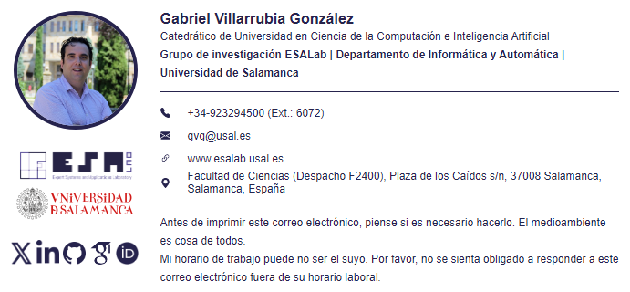

# ✍️ Mail Signature

Firma de correo electrónico en HTML, lista para pegar en Gmail, Outlook y demás clientes de correo. Incluye foto de perfil, logos con hipervínculo, iconos de contacto y redes sociales, y está pensada para que **no se rompa ni se vea gigante en Outlook** 🛡️.

## 👀 Así se ve

<p align="center">
  
</p>

## ✨ Características

- 🖼️ Foto de perfil circular + logos de **ESALab** y la **Universidad de Salamanca**, cada uno enlazado a su web ([esalab.es](https://www.esalab.es) / [usal.es](https://www.usal.es))
- 🌐 Iconos de contacto (teléfono ☎️, email 📧, web 🔗, ubicación 📍) y redes sociales (X, LinkedIn, GitHub, Google Scholar, ORCID)
- 🇪🇸 🇬🇧 Disponible en español ([signature_spa.html](signature_spa.html)) e inglés ([signature_eng.html](signature_eng.html))
- 📏 Todas las imágenes llevan `width`/`height` explícitos para evitar el clásico bug de **Outlook** que las muestra enormes
- ✅ HTML validado (sin etiquetas huérfanas ni mal cerradas)

## 🚀 Cómo usarla

1. Abre el fichero HTML que quieras (`signature_spa.html` o `signature_eng.html`) en un navegador.
2. Selecciona todo el bloque de la firma (`Ctrl+A` / `Cmd+A`) y cópialo (`Ctrl+C` / `Cmd+C`).
3. Pégalo en el editor de firmas de tu cliente de correo (Gmail, Outlook, Apple Mail...).
4. Ajusta tus propios datos de contacto si vas a reutilizar la plantilla. 🎉

## 📁 Estructura

```
mailSignature/
├── signature_spa.html   # Firma en español
├── signature_eng.html   # Firma en inglés
└── img/                 # Logos, iconos y foto de perfil
```

## 📄 Licencia

Distribuido bajo licencia [GPL-3.0](LICENSE).
